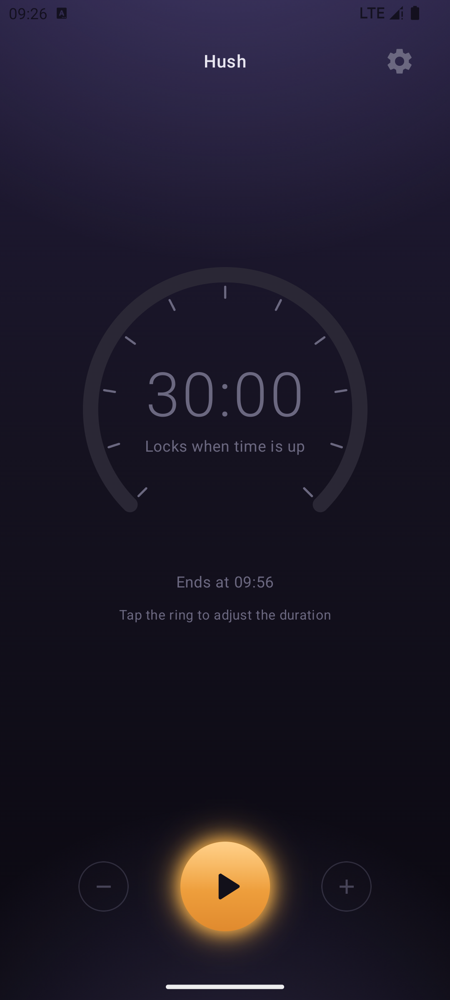
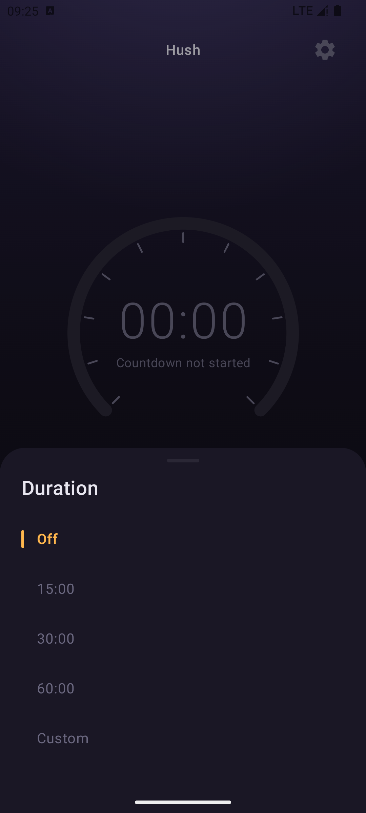
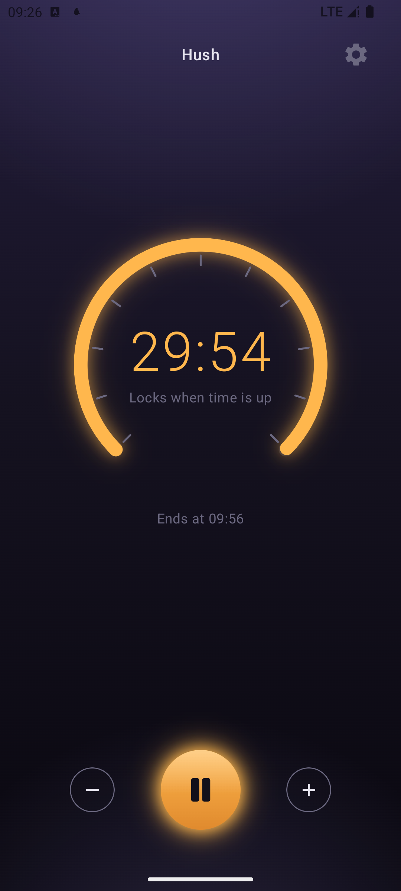
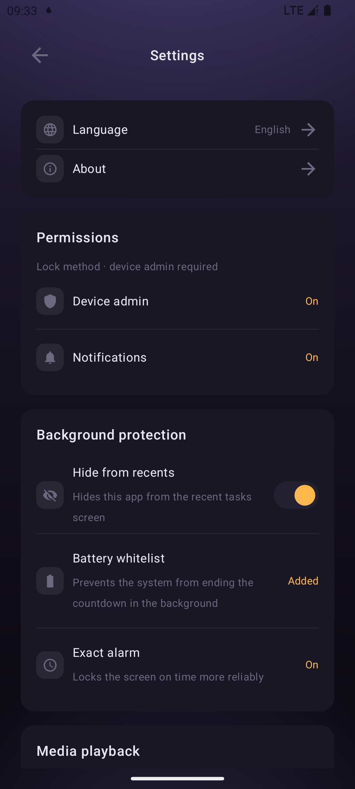
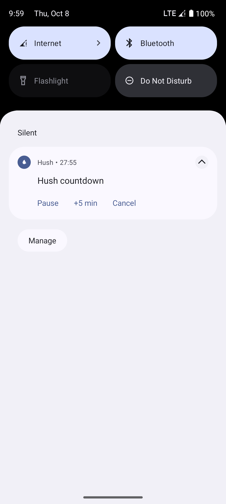

# Hush

[中文](README.zh-CN.md)

[](https://github.com/lete114/Hush/actions/workflows/test.yml)


[](LICENSE)

A countdown auto-lock Android app — set a duration, and the screen locks itself when time is up.

Hush is for the moments when you want the screen off but never get around to pressing the power button: falling asleep to a song, watching a video in bed, or focusing on something else with the phone lying face up. Start the countdown and put the phone down — when the timer reaches zero the screen locks, optionally pausing whatever was still playing.

While the countdown runs, a live timer sits in the notification with **pause / extend / cancel** controls, so you can adjust it without unlocking the phone. If a lock ever fails — say, device admin got disabled — Hush notifies you instead of failing silently. Everything happens on your device: no `INTERNET` permission, no accounts, no analytics, no telemetry.

| Idle | Duration picker | Running |
| --- | --- | --- |
|  |  |  |

| Settings | Notification |
| --- | --- |
|  |  |

## Features

- **Auto lock**: locks the screen when the countdown reaches zero (device admin `force-lock`, a single minimal policy)
- **Duration presets**: Off / 15 / 30 / 60 minutes / custom (≥ 60 seconds)
- **Countdown in the notification**: shows the remaining time in real time with pause / extend / cancel controls
- **Pause media on lock** (optional): pauses playing audio and video when the screen locks
- **Lock failure alert**: notifies you when the countdown ends but the screen was not locked because device admin was turned off
- **Battery whitelist / exact alarm**: reached directly from Settings for reliable on-time triggering
- **Bilingual UI**: 简体中文 / English

## Privacy

Hush **does not go online and collects nothing**:

- `INTERNET` permission is not declared — no accounts, no analytics, no ads, no telemetry
- All data (duration preferences, language) is stored on the device only (SharedPreferences)
- Locking goes through device admin `force-lock` only; it does not read, modify, or delete any of your data

## Permissions

| Permission | Purpose |
| --- | --- |
| Device admin (`force-lock`) | Locks the screen when the countdown ends |
| Notifications `POST_NOTIFICATIONS` | Shows the countdown and its controls |
| Exact alarm `SCHEDULE_EXACT_ALARM` | Reliable on-time lock |
| Ignore battery optimizations | Prevents the system from ending the countdown in the background |
| Foreground service (`specialUse`) | Keeps the service active while the countdown runs |

## Building

Requires **JDK 21** (JDK 25 crashes at the Kotlin 2.2.21 compiler layer) and Android SDK 36.

```bash
export JAVA_HOME='<path to your JDK 21>'

./gradlew test           # unit tests (the only quality gate)
./gradlew assembleDebug  # build the debug APK
```

On Windows (PowerShell), use `gradlew.bat` instead and set the environment variable per session:

```powershell
$env:JAVA_HOME='<path to your JDK 21>'
.\gradlew.bat test
.\gradlew.bat assembleDebug
```

## License

[GPL-3.0](LICENSE)

In-app icons are from Google Material Symbols ([Apache-2.0](https://www.apache.org/licenses/LICENSE-2.0)).
